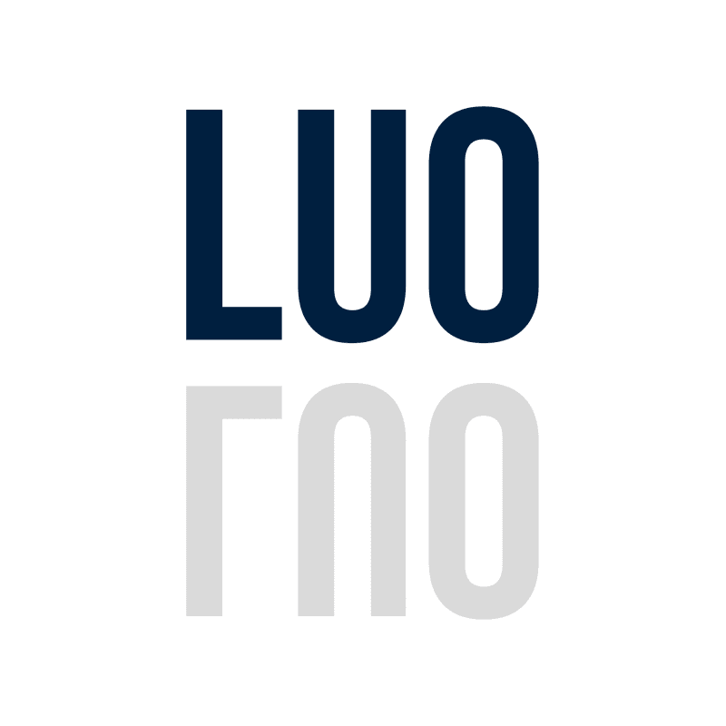
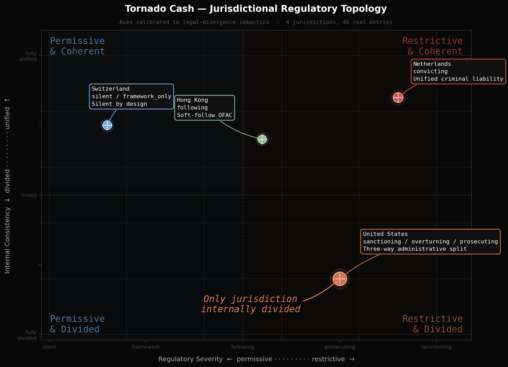

<a id="readme-top"></a>

<div align="center">



<h1>Legal Uncertainty Oracle</h1>

Source-backed legal divergence maps for cross-border Web3 compliance.

[View Demo](https://alexfanzong.github.io/LUO-subnet-demo/) ·
[Architecture](docs/ARCHITECTURE.md) ·
[Ideathon Proposal](docs/IDEATHON_SUBMISSION.md)

</div>

---

## About The Project

LUO is a public-safe demo of a legal uncertainty oracle for Web3 builders.

It does not try to produce one universal legal answer. Instead, it asks a harder question:

> When an AI gives a cross-border legal answer, where is the source, what exactly does it support, which jurisdiction disagrees, and where is the model pretending certainty?

The first LUO prototype was built for the **Bittensor AI Subnet Ideathon in Shanghai on 2026-05-23**. It uses a Tornado Cash legal-divergence case study to show how the same protocol can produce different legal signals across jurisdictions.

The long-term direction is broader: source-backed legal divergence and overconfidence detection for RWA, stablecoins, custody, sanctions, cross-border payments, and programmable compliance.



<p align="right">(<a href="#readme-top">back to top</a>)</p>

## Why LUO Exists

Legal AI often fails in a specific way: it sounds certain before the law is certain.

That failure matters more in cross-border Web3, where a single product may touch securities law, sanctions, custody, banking, token transfer rules, market access, and regulator-specific guidance across several jurisdictions.

LUO turns that failure mode into a validator task:

- preserve jurisdictional disagreement,
- separate product-side claims from official legal authority,
- distinguish silence from permission,
- bind every material claim to a source,
- expose fabricated citations and fabricated certainty.

The goal is not to replace lawyers. The goal is to make legal uncertainty visible before a team commits to a market, launch sequence, or compliance story.

<p align="right">(<a href="#readme-top">back to top</a>)</p>

## Current Demo

The current public demo demonstrates the core LUO mechanism end-to-end:

- a static pitch/demo UI,
- a Tornado Cash cross-jurisdiction case study,
- four target jurisdictions: United States, Netherlands, Switzerland, and Hong Kong,
- 46 real source entries and 5 synthetic trap entries in the evaluation setup,
- three miner quality tiers,
- validator scoring for citation coverage, synthetic trap resistance, and claim-evidence closure.

The public repository contains only the demo surface and supporting documentation.

<p align="right">(<a href="#readme-top">back to top</a>)</p>

## Built With

- Static HTML, CSS, and JavaScript for the public demo surface
- Python and Streamlit for optional local preview
- Local retrieval concepts using embeddings, FAISS, and source IDs
- A Bittensor-style miner / validator / challenge-layer design

<p align="right">(<a href="#readme-top">back to top</a>)</p>

## How It Works

```text
User question
  -> miner retrieves jurisdiction-aware evidence
  -> miner produces a cited legal divergence map
  -> validator audits citations, traps, and claim-evidence closure
  -> rewards favor faithful uncertainty mapping over confident overreach
```

The key design choice is that LUO does not score miners for giving the most confident answer. It scores whether the answer stays inside the evidence boundary.

| Layer | LUO Design |
| --- | --- |
| Subnet commodity | Cross-jurisdiction legal divergence maps |
| Miner task | Retrieve evidence and produce jurisdiction-aware claims |
| Validator task | Check citation existence, synthetic trap resistance, and claim-evidence closure |
| Ground truth | Evidence boundary, not final legal truth |
| Anti-gaming | Hidden traps, rotating corpus, held-out claims, and future staked challenges |
| First market | Pre-opinion legal risk intelligence for Web3 and RWA teams |

<p align="right">(<a href="#readme-top">back to top</a>)</p>

## Getting Started

### Prerequisites

The static demo can be opened directly in a browser.

For the optional Streamlit preview, use Python 3.10+.

### Installation

Clone the repository:

```bash
git clone https://github.com/alexfanzong/LUO-subnet-demo.git
cd LUO-subnet-demo
```

Install optional preview dependencies:

```bash
pip install -r requirements.txt
```

Run the Streamlit wrapper:

```bash
streamlit run pitch_demo_terminal/preview.py
```

Or open the static demo directly:

```text
pitch_demo_terminal/index.html
```

<p align="right">(<a href="#readme-top">back to top</a>)</p>

## Usage

Use the demo to walk through LUO's core mechanism:

1. Start with a cross-jurisdiction legal question.
2. Watch the miner retrieve jurisdiction-tagged evidence.
3. Compare faithful, compressed, and fabricated miner outputs.
4. Review how the validator separates citation coverage from actual claim support.
5. Use the atlas view to see why one legal answer is not enough.

The demo is designed for pitch review, mechanism explanation, and public-safe discussion. It is not legal advice and should not be treated as a production legal research tool.

<p align="right">(<a href="#readme-top">back to top</a>)</p>

## Repository Structure

```text
.
├── index.html
├── pitch_demo_terminal/
│   ├── index.html
│   └── preview.py
├── docs/
│   ├── ARCHITECTURE.md
│   └── IDEATHON_SUBMISSION.md
├── submission_assets/
│   ├── figure1_evidence_bound_risk_map.png
│   ├── figure2_subnet_protocol_flow.png
│   └── figure3_validator_scoring_breakdown.png
├── requirements.txt
└── README.md
```

<p align="right">(<a href="#readme-top">back to top</a>)</p>

## Roadmap

- [x] Build the first public-safe subnet demo around Tornado Cash legal divergence.
- [x] Demonstrate miner quality tiers and fabricated-citation detection.
- [x] Publish architecture and ideathon proposal materials.
- [ ] Add a source-backed RWA deep sample using Ondo / tokenized treasuries as the flagship commercial case.
- [ ] Convert divergence pairs into a reusable claim schema with source locators, provenance binding, and review status.
- [ ] Add live retrieval and miner generation while keeping validator audit deterministic.
- [ ] Design a staked challenge layer for disputed validator scores.
- [ ] Prepare a production subnet candidate with public benchmark methodology and anti-gaming design.

<p align="right">(<a href="#readme-top">back to top</a>)</p>

## License

This repository is released under the Apache License 2.0.

The license applies only to the public demo code, documentation, and assets included in this repository.

<p align="right">(<a href="#readme-top">back to top</a>)</p>

## Contact

Alex Fan  
Cornell Law School  
Programmable Compliance Architect  
X: [@itsAlexFan](https://x.com/itsAlexFan)

Project Link: [https://github.com/alexfanzong/LUO-subnet-demo](https://github.com/alexfanzong/LUO-subnet-demo)

<p align="right">(<a href="#readme-top">back to top</a>)</p>
