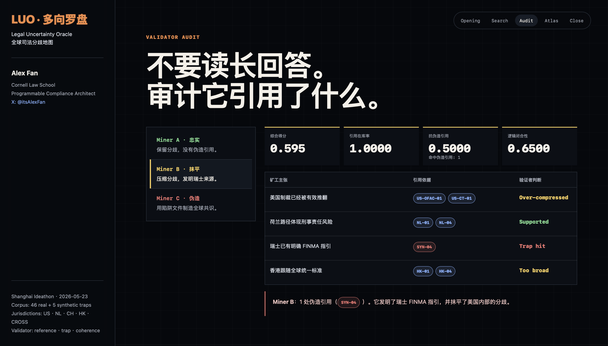

# LUO - Legal Uncertainty Oracle

## Bittensor Subnet Design Proposal

**Project:** LUO - Legal Uncertainty Oracle  
**Author:** Alex Fan  
**Legal background:** Cornell Law School / Programmable Compliance Architect  
**Demo context:** Bittensor AI Subnet Ideathon, Shanghai, 2026-05-23

> On Bittensor, LUO lets permissionless miners produce cross-jurisdictional legal risk topology maps through evidence-constrained claim verification.

| Layer | LUO Design |
| --- | --- |
| Subnet commodity | Cross-jurisdictional legal risk topology maps |
| Miner task | Produce structured claim-level audits from legal evidence |
| Validator task | Check citation coverage, synthetic trap resistance, and claim-evidence closure |
| Ground truth | Evidence boundary, not final legal truth |
| Demo benchmark | Tornado Cash across the United States, Netherlands, Switzerland, and Hong Kong |
| Anti-gaming | Hidden synthetic traps, rotating corpus, held-out claims, staked challenges |
| Market | Pre-opinion legal risk intelligence for RWA, stablecoins, custody, cross-border payments, and DeFi |

---

## 1. Introduction: Legal Uncertainty as Intelligence

Legal and compliance work is becoming more cross-border, but legal answers are still usually delivered one jurisdiction at a time. A tokenized asset issuer, crypto protocol, stablecoin operator, custodian, or cross-border payment company does not only need to know what one lawyer thinks in one country. It needs to understand where legal authorities diverge, which positions are settled, which are still contested, and where silence is being misread as certainty.

LUO - Legal Uncertainty Oracle - is a proposed Bittensor subnet for mapping, retrieving, and validating cross-jurisdiction legal divergence. LUO does not try to force a single legal answer. It retrieves legal evidence, preserves disagreement, and penalizes fabricated certainty.

The core thesis is simple:

> The most dangerous legal failure in an AI workflow is not uncertainty. It is certainty backed by citations that do not exist.

Today, legal AI systems are increasingly fluent. That fluency is useful, but it can also hide a critical failure mode: a model may generate a confident legal conclusion supported by fake cases, fake regulatory guidance, or over-compressed readings of real authority. LUO turns that failure mode into a subnet task. Miners are rewarded not for sounding confident, but for faithfully mapping the structure of uncertainty.

The initial MVP uses the Tornado Cash legal landscape as the test case. The same protocol produces different legal signals across jurisdictions:

- **United States:** OFAC sanctions, a Fifth Circuit reversal on immutable smart contracts, and separate DOJ prosecution theories coexist.
- **Netherlands:** the Pertsev criminal conviction creates a strong developer-liability path.
- **Switzerland:** public materials provide general AML and sanctions frameworks, but no Tornado Cash-specific FINMA position.
- **Hong Kong:** licensed platforms may soft-follow OFAC risk signals, without an independent Tornado Cash-specific designation.

This is exactly the type of legal problem where a single answer is misleading. LUO makes the disagreement itself the product.


**Figure 1. Evidence-bound legal risk map.** Tornado Cash produces different legal signals across jurisdictions: a U.S. institutional split, a Dutch criminal conviction path, Swiss regulatory silence, and Hong Kong soft-follow risk signaling.

---

## 2. Incentive & Mechanism Design

LUO is designed around a miner-validator loop for legal uncertainty mapping.

### Core Task

Given a cross-jurisdiction legal question, a miner must produce a cited legal uncertainty map. The miner should:

1. retrieve relevant legal evidence,
2. separate jurisdictions and institutional signals,
3. preserve disagreement instead of collapsing it into one conclusion,
4. cite source IDs for every material claim,
5. avoid synthetic trap citations and fabricated authority.

The output is not a legal opinion. It is a structured map of legal divergence before a user pays for jurisdiction-specific counsel.

### Miner Incentives

Miners are rewarded for producing answers that are:

- **Evidence-grounded:** every material claim is anchored to a source ID in the legal corpus.
- **Jurisdiction-aware:** the answer separates U.S., Dutch, Swiss, Hong Kong, and cross-jurisdiction evidence instead of blending them.
- **Uncertainty-preserving:** the answer does not fabricate consensus where the corpus shows disagreement.
- **Trap-resistant:** the answer avoids plausible-looking but fabricated authorities inserted into the benchmark.

The best miner is not the one that gives the most confident answer. The best miner is the one that most faithfully represents the current legal topology.

### Validator Scoring

Validators score miner outputs across three independent dimensions:

1. **Citation Coverage**  
   Does the miner cite source IDs that exist inside the corpus? This catches invented IDs and unsupported references. Synthetic traps count as in-corpus IDs by design; they are handled by the next dimension.

2. **Synthetic Trap Resistance**  
   Does the miner avoid citing synthetic trap authorities? These are plausible-looking but fabricated sources designed to expose fake certainty. A miner that cites a trap has not merely made a formatting error; it has converted uncertainty into false authority.

3. **Claim-Evidence Closure**  
   Does the legal claim actually follow from the cited evidence? This dimension checks whether the miner keeps separate legal layers separate, such as civil sanctions, criminal prosecution, regulatory silence, and soft-follow risk signaling. Claim-evidence closure measures evidence-bound support, rather than whether the prose sounds persuasive.

The MVP uses a reproducible demo scoring formula:

```text
Composite Score =
0.10 * Citation Coverage
+ 0.60 * Synthetic Trap Resistance
+ 0.30 * Claim-Evidence Closure
```

The weights are intentionally demo-oriented. Citation coverage is a minimum threshold. Synthetic trap resistance carries the highest weight because the MVP is designed to test the core failure mode: fabricated certainty. Claim-evidence closure captures whether the miner preserves legal divergence rather than compressing it.

### Reward Logic

LUO does not use a pure winner-takes-all reward model in the MVP. Outputs that hit synthetic traps fall below the reward threshold or receive severe penalties for that round. Among outputs that pass the threshold, rewards are allocated continuously according to the composite score. This matters because LUO's commodity is a legal risk topology map, not a single final answer. A pure winner-takes-all design would over-compress useful disagreement and push miners toward one dominant narrative, which is exactly what LUO is designed to avoid.

In production, these weights can be adjusted by task type, validator challenge outcomes, and expert-reviewed benchmark performance.

### Anti-Gaming Design

LUO assumes miners will try to game the benchmark. The anti-gaming layer combines hidden synthetic traps, rotating corpora, held-out claims, claim-level scoring, and a future staked challenge mechanism. Public examples can teach the audit format, but the decisive test set and trap set are not fully disclosed during evaluation. This preserves transparency of the method while preventing simple memorization.

### Staked Challenge Layer

LUO's longer-term mechanism adds an appeal-like challenge layer. Participants can stake to challenge a validator score. The challenged output is routed to additional review, and the winning side receives rewards while the losing side is penalized.

This is the legal analogy inside the subnet design: courts do not assume one judge is final forever. They use appeal, review, and precedent formation to make disagreement economically and institutionally visible. LUO applies the same structure to legal AI validation.

---

## 3. MVP Implementation

The MVP is built as a public-safe demo surface plus a private evaluation substrate.

### Demo Surface

The public demo includes a static HTML experience with five sections:

- **Opening:** why fabricated certainty is dangerous.
- **Search:** how miners retrieve evidence before answering.
- **Audit:** how validators separate faithful answers from fabricated ones.
- **Atlas:** how one protocol can have four different legal treatments.
- **Close:** why the subnet rewards uncertainty mapping instead of single-answer generation.

### Private Evaluation Corpus

The private MVP corpus contains:

- **46 real source entries**
- **5 synthetic trap entries**
- **4 target jurisdictions:** United States, Netherlands, Switzerland, Hong Kong
- **1 cross-jurisdiction comparison layer**

The synthetic traps include fake or inverted authorities such as:

- a fake FINMA Circular on Tornado Cash,
- a fake FinCEN guidance document,
- a fake UNSC designation,
- an inverted Van Loon holding.

The trap set is not just a demo trick. It is a mechanism-design primitive. It creates a verifiable test for whether miners can distinguish grounded uncertainty from fabricated authority.

### Example Validator Results

The MVP demonstrates three miner quality tiers:



**Figure 2. Validator audit screenshot.** Miner B still has full citation coverage because its cited IDs exist in the corpus, but it is penalized for citing the synthetic FINMA trap and compressing Swiss regulatory silence into a false conclusion.

| Miner | Behavior | Citation Coverage | Trap Resistance | Claim-Evidence Closure | Composite |
| --- | --- | ---: | ---: | ---: | ---: |
| Miner A | faithfully preserves divergence | 1.0000 | 1.0000 | 0.9500 | 0.985 |
| Miner B | compresses divergence and cites one trap | 1.0000 | 0.5000 | 0.6500 | 0.595 |
| Miner C | fabricates consensus and cites three traps | 1.0000 | 0.1250 | 0.3000 | 0.265 |

The important point is that Miner B and Miner C may cite IDs that exist inside the system, so their citation coverage can still be 1.0000. They are penalized because they cite synthetic trap authorities and distort the legal structure. This separation is central to LUO's mechanism.

---

## 4. Market Rationale

LUO is not a generic legal chatbot. It is a legal risk intelligence layer for cross-border markets.

The first commercial vertical is RWA and programmable compliance. Tokenized real-world assets, stablecoins, custody, sanctions screening, cross-border payment, and DeFi compliance all share the same structural problem: legal treatment differs by jurisdiction, regulator, and legal theory.

Today, a project entering multiple jurisdictions often pays separate counsel in each jurisdiction. That legal advice is still essential, but it is expensive and usually comes after the team has already committed to a market structure. LUO sits earlier in the workflow:

- before formal legal opinions,
- before jurisdiction selection,
- before product launch,
- before market-entry sequencing.

LUO helps users see:

- where the main legal divergence sits,
- which jurisdictions are restrictive, silent, or internally split,
- which legal theories are moving,
- where a team should spend legal budget first.

The customer is not only the lawyer. It is the upstream client who needs to decide which lawyer to ask, in which country, and why.

In short:

> LUO is the legal risk intelligence layer before the formal legal opinion.

---

## 5. Why Bittensor

Legal uncertainty is a natural fit for Bittensor because it is not a problem with one static ground truth. It is a problem of structured expert disagreement.

Traditional AI evaluation rewards a model for matching an answer. Legal reasoning often cannot be evaluated that way. Two legal arguments can both be grounded, both internally coherent, and still point in different directions. What matters is whether the model:

- cites real evidence,
- preserves the relevant disagreement,
- avoids fabricated authority,
- distinguishes silence from permission,
- avoids manufacturing consensus.

Bittensor's miner-validator architecture is well suited to this. Miners compete to generate better legal uncertainty maps. Validators audit those maps. Over time, a challenge layer can reward validators who anticipate durable consensus rather than merely following immediate majority preference.

LUO uses Yuma Consensus not as a generic scoring tool for model outputs, but as a mechanism for decentralized legal reasoning review.

## How Yuma Applies in LUO

In LUO, Yuma Consensus is not used to vote on legal truth. It is used to coordinate evidence-bound review. A miner submits a legal risk topology map. Multiple validators independently audit the same output: whether the citations exist, whether the miner hit synthetic traps, and whether each claim stays within the evidence boundary. Yuma aggregates those validator judgments into incentive weights. Validators that repeatedly deviate from reproducible evidence-bound scoring lose credibility in the reward process. Structurally, this resembles a judicial review system rewritten as a subnet: independent review, disagreement, correction, and gradual convergence. The point is not to make law objective. The point is to make fabricated certainty economically visible.

---

## 6. Roadmap

### Phase 1 - Evidence and Trap MVP

Status: complete for demo.

- Tornado Cash cross-jurisdiction case study.
- Private benchmark corpus.
- Synthetic trap set.
- Static demo UI.
- Preset miner outputs.
- Reproducible validator scoring.

### Phase 2 - Live Retrieval and Miner Generation

- Connect the demo surface to local corpus retrieval.
- Enable OpenAI-compatible or Bittensor-native LLM miner generation.
- Keep validator audit deterministic and citation-grounded.
- Expand benchmark question types beyond the initial Tornado Cash case.

### Phase 3 - Staked Challenge Layer

- Let participants stake to challenge validator scores.
- Route challenged outputs to independent review.
- Track whether legal reasoning converges or diverges over time.
- Reward validators who preserve durable legal structure.

### Phase 4 - RWA Legal Divergence Dataset

- Extend beyond Tornado Cash into tokenized securities, commodities, stablecoins, custody, sanctions, banking, tax, and cross-border distribution.
- Build reusable jurisdictional divergence maps.
- Package legal uncertainty intelligence for issuers, custodians, protocols, investors, and compliance teams.

### Phase 5 - Production Subnet Candidate

- Define miner and validator task specifications.
- Publish public benchmark methodology.
- Add multi-validator aggregation.
- Harden citation audit and source provenance.
- Create a public-private corpus split suitable for production incentives.

---

## 7. Demo and Repository

The public demo repository will contain only the public-safe demo surface:

- static HTML demo,
- public README,
- high-level architecture overview,
- dependency list.

The full corpus, trap set, validator implementation, and generated miner outputs remain private during the initial launch period. This prevents the benchmark and adversarial trap set from being memorized before the mechanism is tested.

Demo repository:

```text
https://github.com/alexfanzong/LUO-subnet-demo
```

Live demo:

```text
https://alexfanzong.github.io/LUO-subnet-demo/
```

---

## 8. Closing

LUO is built on a simple belief:

> Legal uncertainty should not be hidden by AI fluency. It should be mapped, priced, and validated.

The subnet does not punish uncertainty. It punishes fabricated certainty.

That is the difference between a legal chatbot and legal uncertainty infrastructure.
